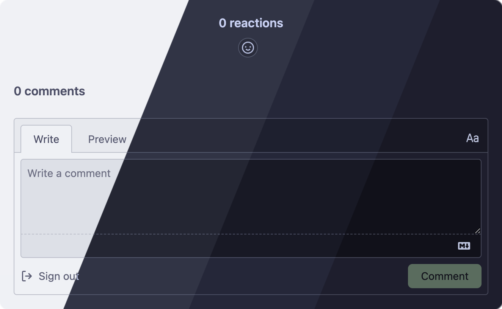
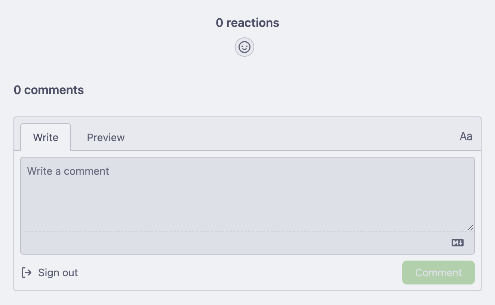
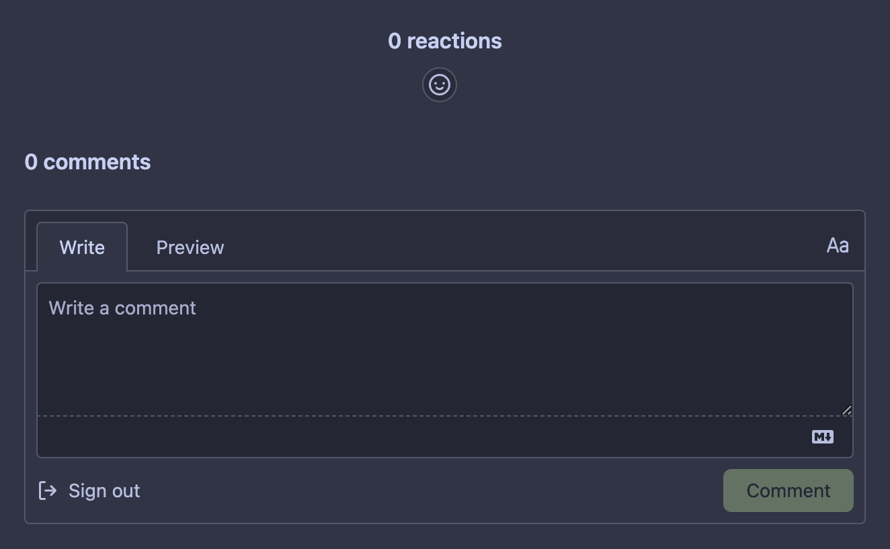
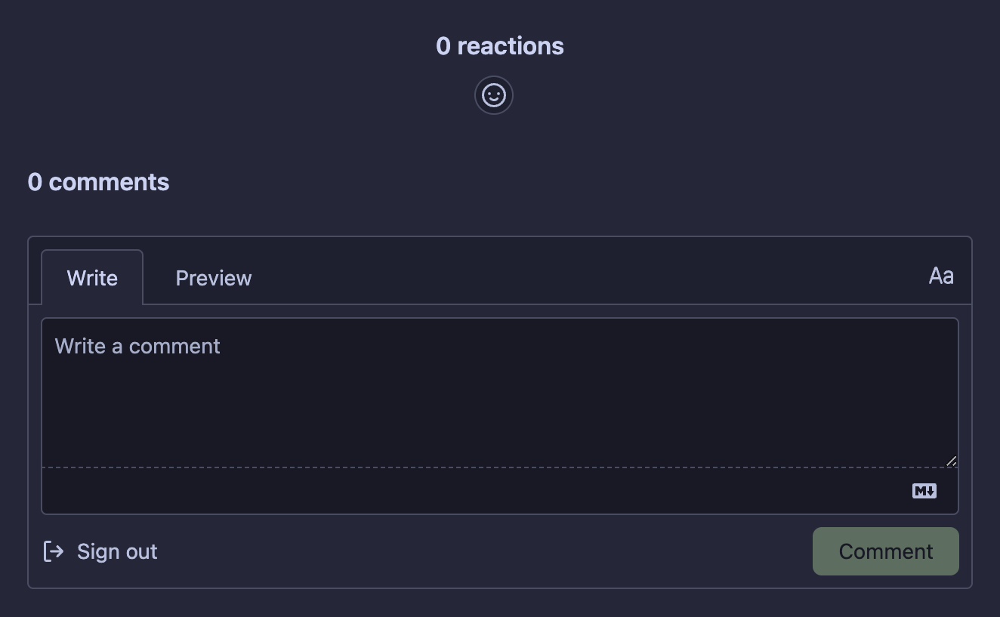
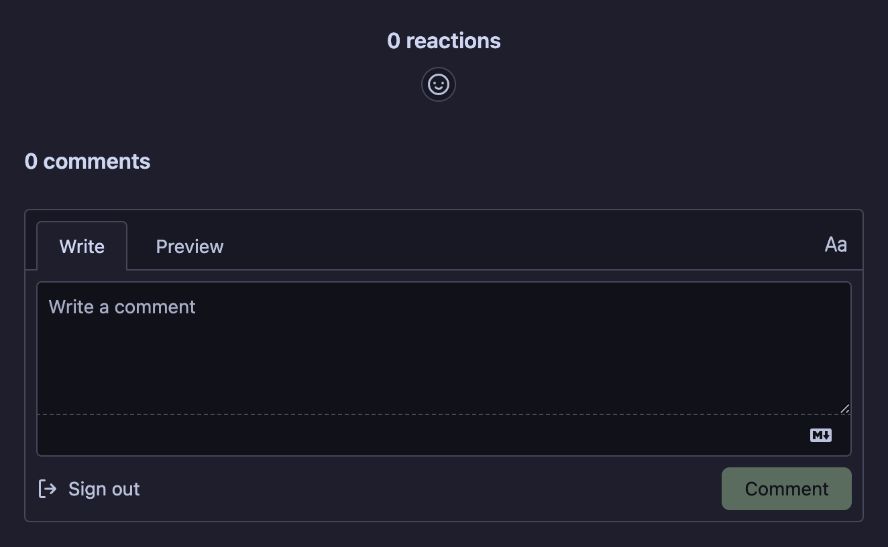

<h3 align="center">
	 
	
	Catppuccin for <a href="https://giscus.app/">Giscus</a>
	
</h3>

	
	
	

	

## Previews

🌻 Latte

🪴 Frappé

🌺 Macchiato

🌿 Mocha

## Usage

1. Set the `data-theme` attribute on your Giscus `<script>` tag to `https://giscus.catppuccin.com/themes/<flavor>.css` (where `<flavor>` is one of `latte`, `frappe`, `macchiato`, or `mocha`).

> [!TIP]
> If you don't want the Pepperjack loading spinner, add `-no-loader` after the name of the flavor: `https://giscus.catppuccin.com/themes/<flavor>-no-loader.css`.

## 💝 Thanks to

- [uncenter](https://github.com/uncenter)

&nbsp;

	

	Copyright &copy; 2021-present <a href="https://github.com/catppuccin" target="_blank">Catppuccin Org</a>

	

